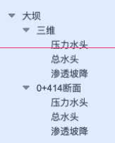

> ### 1.文件提供说明
 需提供文件包括单文件或者文件夹形式的模型数据或2中json数据，若有过程线数据则提供3中json数据。文件夹目录结构同实际展示结果树一致。

  

该结构目录树对应文件夹结构如下：
+ 大坝
    + 三维
        + 三维.txt
    + 0+414断面
        + 0+414断面.txt


**若存在结果步，则按下列结构存放文件：**
+ 建设期
    + 大坝
        + 三维
            + 三维.txt
        + 0+414断面
            + 0+414断面.txt
+ 运维期
    + 大坝
        + 三维
            + 三维.txt
        + 0+414断面
            + 0+414断面.txt
> ### 2.基本信息、材料参数、荷载
  数组material存放不同的本构模型参数，根据实际计算情况添加；数组materialName长度需和数组1-6长度一致；load表示荷载信息，name、vaule数组可动态添加，长度保持一致。

```json
{
    "basicInfo": {
        "name": "滩坑计算1",
        "mode": "变形分析",
        "date": "2021年11月22日",
        "submitter": "肖羽",
        "description": "描述信息",
        "material": [
            {
                "constitutiveModel": "堆石体（邓肯-张E-B）",
                "materialName": [
                    "垫层料",
                    "过渡料",
                    "主推"
                ],
                "materialValues": [
                    {
                        "name": "γ(kN/m^3)",
                        "val": ["数组1"]
                    },
                    {
                        "name": "c(GPa)",
                        "val": ["数组2"]
                    }
                ]
            },
            {
                "constitutiveModel": "混凝土及岩基（弹性）",
                "materialName": [
                    "混凝土面板",
                    "混凝土防浪墙",
                    "坝基弱风化岩石体"
                ],
                "materialValues": [
                    {
                        "name": "γ(kN/m^3)",
                        "val": ["数组3"]
                    },
                    {
                        "name": "E(GPa)",
                        "val": ["数组4"]
                    }
                ]
            },
            {
                "constitutiveModel": "堆石体流变参数（伯格斯）",
                "materialName": [
                    "垫层",
                    "过渡层",
                    "主堆"
                ],
                "materialValues": [
                    {
                        "name": "E_k(GPa)",
                        "val": ["数组5"]
                    },
                    {
                        "name": "η_k(GPa·s)",
                        "val": ["数组6"]
                    }
                ]
            }
        ],
        "load": {
            "name": [
                "水位",
                "日期"
            ],
            "value": [
                "100m",
                "2021年11月22日"
            ]
        }
    }
}
```
### 数据对应关系
* 数组1、2数据


* 数组3、4数据


* 数组5、6数据


> ### 3.结果过程线
units数组长度为2，分别填写x、y轴单位； coordinate数组中一个对象对应一条曲线，顺序和lineName中名称一致，x、y分别是该曲线的x、y坐标数组，长度需一致。
```json
{
    "lineResult": {
        "units": ["x轴单位", "y轴单位"],
        "lineName": ["过程线1", "过程线2", "过程线3"],
        "coordinate": [
            //过程线1坐标
            {
                "x": [],
                "y": []
            },

            //过程线2坐标
            {
                "x": [],
                "y": []
            },

            //过程线3坐标
            {
                "x": [],
                "y": []
            }
        ]
    }
}
```
